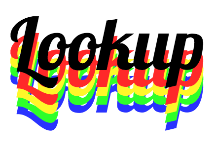

## Todo
- caching
- ember
- dialog
- Testing

## Who are we

Lookup was designed and developed by Sam Gregory so that people could spend more time looking at their phones than actualy discovering the world around them for themselves.

## The code

Lookup was built using static-site templating language [Handlebars](http://handlebarsjs.com/), [SASS](http://sass-lang.com/), and ES2015 using [Webpack](https://webpack.github.io/) to use ES2015 module definition system. Interacting with the Foursquare API using AJAX to retrieve the most popular places in a given location, plus the users current location (on local server as https is required). With the help of [Bootstrap-sass](http://getbootstrap.com/) so that i was able to quickly put together a mobile-first website and adjust styles where necessary. 

I used task-runner [Grunt](http://gruntjs.com/) to assemble and build the code.

## Documentation

All Javascript is documented and can be seen at lookup.samgregory.media/docs.

